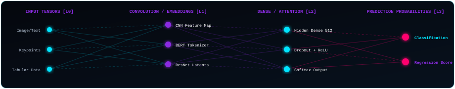
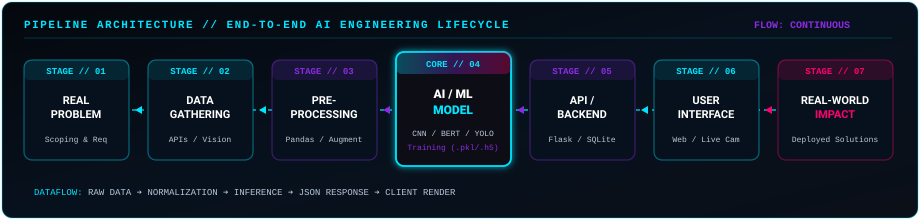
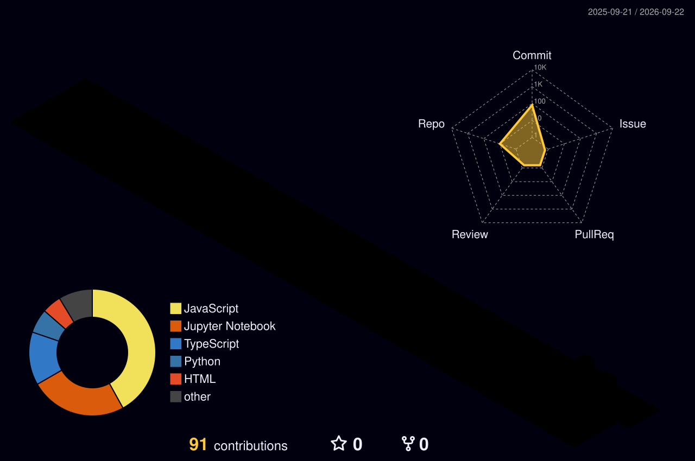
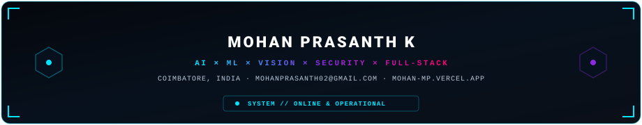

<div align="center">

<!-- 01 — HERO BANNER -->


<br/>

<!-- QUICK SYSTEM HUD BADGES -->
[](https://mohan-mp.vercel.app/)
[](https://github.com/mohanprasanth02)
[](mailto:mohanprasanth02@gmail.com)
[](https://mohan-mp.vercel.app/)


</div>

<!-- 02 — SYSTEM STATUS -->
## 📡 02 // SYSTEM DIAGNOSTICS &amp; TELEMETRY

<div align="center">
  
</div>

<br/>


<!-- 03 — ABOUT -->
## 🧠 03 // EXECUTIVE BRIEFING

```yaml
AI_DEVELOPER_PROFILE:
  Operative: "Mohan Prasanth K"
  Role: "AI & Machine Learning Developer · Full-Stack Engineer"
  Core_Focus: "Computer Vision · Deep Learning · Intelligent Web Applications · Cybersecurity"
  Location: "Annur, Coimbatore, Tamil Nadu, India"
  Current_Academic_Track: "B.E. in Artificial Intelligence & Machine Learning (2025–2028)"
  System_Philosophy: "Intelligent AI models. Built for full-stack impact."
```

> **"AI is how I innovate — full-stack code is how I build it."**
>
> I am an **AI & Machine Learning Developer** based in Coimbatore, India, specializing in the development and deployment of end-to-end intelligent systems. My work spans deep learning neural networks, computer vision classification and recognition pipelines, real-time Natural Language Processing (NLP), and secure Flask-powered web backends.
>
> With over **12 months of industry and project engineering experience** across Athithya Technologies and Alfido Tech, combined with **AWS Cloud virtual architecture foundations**, I engineer complete AI applications from raw dataset curation and tensor modeling (`.pkl` / `.h5`) to responsive production web interfaces and biometric security workflows.

<br/>


<!-- 04 — AI TECHNOLOGY MATRIX -->
## ⚡ 04 // AI TECHNOLOGY MATRIX

<div align="center">
  
</div>

<br/>

<table>
  <thead>
    <tr>
      <th width="28%" align="left">🎛️ DOMAIN</th>
      <th width="42%" align="left">🛠️ CORE TECHNOLOGIES &amp; LIBRARIES</th>
      <th width="30%" align="left">⚙️ APPLIED CAPABILITIES</th>
    </tr>
  </thead>
  <tbody>
    <tr>
      <td><b>🧠 AI &amp; Machine Learning</b></td>
      <td>
        <code>Python</code> · <code>TensorFlow</code> · <code>PyTorch</code> · <code>Keras</code><br/>
        <code>Scikit-learn</code> · <code>Pandas</code> · <code>NumPy</code>
      </td>
      <td>Supervised &amp; Unsupervised Learning, Feature Engineering, Neural Optimization</td>
    </tr>
    <tr>
      <td><b>👁️ Computer Vision</b></td>
      <td>
        <code>OpenCV</code> · <code>MediaPipe</code> · <code>YOLO</code><br/>
        <code>CNN</code> · <code>FaceNet</code> · <code>Transfer Learning</code>
      </td>
      <td>Landmark Tracking, Face Biometrics, Object Detection, Defect Inspection</td>
    </tr>
    <tr>
      <td><b>🌐 Web &amp; Backend</b></td>
      <td>
        <code>Flask</code> · <code>REST APIs</code> · <code>HTML5</code><br/>
        <code>CSS3</code> · <code>JavaScript</code> · <code>SQLite</code> · <code>SQL</code>
      </td>
      <td>Full-Stack AI Web Apps, Real-time Model Inference Endpoints, Session Auth</td>
    </tr>
    <tr>
      <td><b>🛡️ Cybersecurity &amp; Auth</b></td>
      <td>
        <code>SNORT NIDS</code> · <code>TOTP / MFA</code> · <code>Python Automation</code><br/>
        <code>Threat Logging</code> · <code>Security Policies</code>
      </td>
      <td>Intrusion Detection Systems, 3-Factor Biometric Auth, Age Verification Gate</td>
    </tr>
    <tr>
      <td><b>☁️ Data &amp; Cloud Analytics</b></td>
      <td>
        <code>AWS Cloud (EC2, S3, IAM)</code> · <code>Power BI</code><br/>
        <code>Tableau</code> · <code>Data Science</code> · <code>Excel Analytics</code>
      </td>
      <td>Cloud Virtual Infrastructure, Business Intelligence Dashboards, Reporting</td>
    </tr>
  </tbody>
</table>

<br/>


<!-- 05 — FEATURED AI SYSTEMS -->
## 🔬 05 // FEATURED AI SYSTEMS &amp; DEPLOYED MODULES

<table>
  <tr>
    <td width="50%" valign="top">
      <div align="left">
        <h3><code>PROJECT_01</code> // AI-Powered Cyberbullying Detection</h3>
        <p><b>Domain:</b> NLP · Machine Learning · Web Safety<br/>
        <b>Stack:</b> <code>Python</code> <code>BERT/LSTM</code> <code>NLP</code> <code>Flask</code><br/>
        <b>Status:</b> <code>DEPLOYED / OPERATIONAL</code></p>
        <p>Real-time NLP-based cyberbullying and harassment detection engine for social media platforms with automated moderation pipeline and live text scoring.</p>
        <p>
          <a href="https://mohan-mp.vercel.app/work/cyberbullying-detection"><b>[ 🌐 LIVE SYSTEM DOSSIER ]</b></a>
          &nbsp;&nbsp;
          <a href="https://github.com/mohanprasanth02"><b>[ 💻 SOURCE REPO ]</b></a>
        </p>
      </div>
    </td>
    <td width="50%" valign="top">
      <div align="left">
        <h3><code>PROJECT_02</code> // Hand Gesture Recognition</h3>
        <p><b>Domain:</b> Computer Vision · Deep Learning · HCI<br/>
        <b>Stack:</b> <code>OpenCV</code> <code>MediaPipe</code> <code>CNN</code> <code>Python</code><br/>
        <b>Status:</b> <code>DEPLOYED / OPERATIONAL</code></p>
        <p>Touchless smartphone and web interaction interface utilizing real-time 21-hand-landmark tracking and a customized CNN gesture classifier.</p>
        <p>
          <a href="https://mohan-mp.vercel.app/work/hand-gesture-recognition"><b>[ 🌐 LIVE SYSTEM DOSSIER ]</b></a>
          &nbsp;&nbsp;
          <a href="https://github.com/mohanprasanth02"><b>[ 💻 SOURCE REPO ]</b></a>
        </p>
      </div>
    </td>
  </tr>
  <tr>
    <td width="50%" valign="top">
      <div align="left">
        <h3><code>PROJECT_03</code> // Plant Disease AI Diagnosis</h3>
        <p><b>Domain:</b> Deep Learning · Agriculture AI · Vision<br/>
        <b>Stack:</b> <code>CNN</code> <code>Transfer Learning (ResNet/MobileNet)</code> <code>Flask</code><br/>
        <b>Status:</b> <code>DEPLOYED / OPERATIONAL</code></p>
        <p>Automated visual crop disease diagnostic tool leveraging deep transfer learning on agricultural leaf pathology datasets with instant web feedback.</p>
        <p>
          <a href="https://mohan-mp.vercel.app/work/plant-disease-detection"><b>[ 🌐 LIVE SYSTEM DOSSIER ]</b></a>
          &nbsp;&nbsp;
          <a href="https://github.com/mohanprasanth02"><b>[ 💻 SOURCE REPO ]</b></a>
        </p>
      </div>
    </td>
    <td width="50%" valign="top">
      <div align="left">
        <h3><code>PROJECT_04</code> // Real-Time Facial Emotion AI</h3>
        <p><b>Domain:</b> Computer Vision · Affective Computing<br/>
        <b>Stack:</b> <code>OpenCV</code> <code>CNN</code> <code>Deep Learning</code> <code>Python</code><br/>
        <b>Status:</b> <code>DEPLOYED / OPERATIONAL</code></p>
        <p>Webcam-based real-time facial feature extraction and multi-class emotion classification pipeline for enhanced Human-Computer Interaction.</p>
        <p>
          <a href="https://mohan-mp.vercel.app/work/facial-expression-recognition"><b>[ 🌐 LIVE SYSTEM DOSSIER ]</b></a>
          &nbsp;&nbsp;
          <a href="https://github.com/mohanprasanth02"><b>[ 💻 SOURCE REPO ]</b></a>
        </p>
      </div>
    </td>
  </tr>
  <tr>
    <td width="50%" valign="top">
      <div align="left">
        <h3><code>PROJECT_05</code> // Face Recognition Payment System</h3>
        <p><b>Domain:</b> Biometrics · FinTech AI · Full-Stack<br/>
        <b>Stack:</b> <code>FaceNet</code> <code>OpenCV</code> <code>Flask</code> <code>SQLite</code><br/>
        <b>Status:</b> <code>DEPLOYED / OPERATIONAL</code></p>
        <p>Contactless biometric payment architecture computing 128-d facial embeddings for zero-friction user verification and transactional wallet debiting.</p>
        <p>
          <a href="https://mohan-mp.vercel.app/work/face-recognition-payment-system"><b>[ 🌐 LIVE SYSTEM DOSSIER ]</b></a>
          &nbsp;&nbsp;
          <a href="https://github.com/mohanprasanth02"><b>[ 💻 SOURCE REPO ]</b></a>
        </p>
      </div>
    </td>
    <td width="50%" valign="top">
      <div align="left">
        <h3><code>PROJECT_06</code> // FacePass 3-Factor Authentication</h3>
        <p><b>Domain:</b> Web Security · Biometric MFA<br/>
        <b>Stack:</b> <code>Flask</code> <code>TOTP</code> <code>OpenCV</code> <code>Python</code> <code>SQLite</code><br/>
        <b>Status:</b> <code>DEPLOYED / OPERATIONAL</code></p>
        <p>High-security 3-tier authentication protocol uniting traditional password credentials, time-based one-time passwords (TOTP), and live facial recognition.</p>
        <p>
          <a href="https://mohan-mp.vercel.app/work/mfa-password-otp-face"><b>[ 🌐 LIVE SYSTEM DOSSIER ]</b></a>
          &nbsp;&nbsp;
          <a href="https://github.com/mohanprasanth02"><b>[ 💻 SOURCE REPO ]</b></a>
        </p>
      </div>
    </td>
  </tr>
  <tr>
    <td width="50%" valign="top">
      <div align="left">
        <h3><code>PROJECT_07</code> // Fruit Defect Detection Dashboard</h3>
        <p><b>Domain:</b> Computer Vision · Quality Assurance AI<br/>
        <b>Stack:</b> <code>YOLO</code> <code>CNN</code> <code>Flask</code> <code>Computer Vision</code><br/>
        <b>Status:</b> <code>DEPLOYED / OPERATIONAL</code></p>
        <p>Automated visual defect identification dashboard evaluating agricultural produce freshness and surface blemish grading with rapid inference.</p>
        <p>
          <a href="https://mohan-mp.vercel.app/work/fruit-defect-detection-web"><b>[ 🌐 LIVE SYSTEM DOSSIER ]</b></a>
          &nbsp;&nbsp;
          <a href="https://github.com/mohanprasanth02"><b>[ 💻 SOURCE REPO ]</b></a>
        </p>
      </div>
    </td>
    <td width="50%" valign="top">
      <div align="left">
        <h3><code>PROJECT_08</code> // SNORT NIDS Threat Engine</h3>
        <p><b>Domain:</b> Cybersecurity · Network Defense<br/>
        <b>Stack:</b> <code>SNORT</code> <code>Python</code> <code>Network Security</code> <code>Log Parser</code><br/>
        <b>Status:</b> <code>DEPLOYED / OPERATIONAL</code></p>
        <p>Network intrusion detection system pairing SNORT packet analysis with custom Python automation scripts for dynamic rule generation and alert dispatch.</p>
        <p>
          <a href="https://mohan-mp.vercel.app/work/snort-intrusion-detection"><b>[ 🌐 LIVE SYSTEM DOSSIER ]</b></a>
          &nbsp;&nbsp;
          <a href="https://github.com/mohanprasanth02"><b>[ 💻 SOURCE REPO ]</b></a>
        </p>
      </div>
    </td>
  </tr>
  <tr>
    <td width="50%" valign="top">
      <div align="left">
        <h3><code>PROJECT_09</code> // Plastic Waste Prediction System</h3>
        <p><b>Domain:</b> Predictive ML · Environmental Analytics<br/>
        <b>Stack:</b> <code>Scikit-learn</code> <code>Pandas</code> <code>Flask</code> <code>SQLite</code> <code>.pkl</code><br/>
        <b>Status:</b> <code>DEPLOYED / OPERATIONAL</code></p>
        <p>Full-stack environmental intelligence platform forecasting plastic waste generation volumes based on demographic and consumption parameters.</p>
        <p>
          <a href="https://mohan-mp.vercel.app/work/plastic-waste-prediction"><b>[ 🌐 LIVE SYSTEM DOSSIER ]</b></a>
          &nbsp;&nbsp;
          <a href="https://github.com/mohanprasanth02"><b>[ 💻 SOURCE REPO ]</b></a>
        </p>
      </div>
    </td>
    <td width="50%" valign="top">
      <div align="left">
        <h3><code>PROJECT_10</code> // Age Automation Security System</h3>
        <p><b>Domain:</b> Deep Learning · Compliance &amp; Safety<br/>
        <b>Stack:</b> <code>Deep Learning (.h5)</code> <code>OpenCV</code> <code>Flask</code> <code>Python</code><br/>
        <b>Status:</b> <code>DEPLOYED / OPERATIONAL</code></p>
        <p>AI-driven age classification and policy enforcement gateway designed to secure social platforms by preventing underage access to restricted digital content.</p>
        <p>
          <a href="https://mohan-mp.vercel.app/work/age-automation-system"><b>[ 🌐 LIVE SYSTEM DOSSIER ]</b></a>
          &nbsp;&nbsp;
          <a href="https://github.com/mohanprasanth02"><b>[ 💻 SOURCE REPO ]</b></a>
        </p>
      </div>
    </td>
  </tr>
</table>

<br/>


<!-- 06 — ENGINEERING PIPELINE -->
## 🔄 06 // END-TO-END ENGINEERING PIPELINE

<div align="center">
  
</div>

<br/>


<!-- 07 — EXPERIENCE -->
## 💼 07 // PROFESSIONAL FLIGHT LOG &amp; EXPERIENCE

```
========================================================================================
[TIMELINE]                 [ORGANIZATION]                      [ROLE / SPECIALIZATION]
========================================================================================
JUNE 2024 – JUNE 2025  ➔  Athithya Technologies            ➔  Content Writer & ML Project Developer
                           (Sathyamangalam, India)             • Developed real-time ML Flask web applications
                                                               • Trained & evaluated Scikit-learn / Pandas models
                                                               • Authored original technical & academic documentation

JUNE 2026 – JULY 2026  ➔  Alfido Tech                      ➔  Machine Learning Intern
                           (Remote, India)                     • Engineered end-to-end Python ML training pipelines
                                                               • Performed advanced data cleaning & feature scaling
                                                               • Evaluated classification metrics & loss reduction

MAY 2023 – JUNE 2023   ➔  Amazon Web Services (AWS)        ➔  Cloud Virtual Intern
                           (Virtual)                           • Managed AWS core services: EC2, S3, IAM, and VPCs
                                                               • Gained hands-on cloud architecture & security fundamentals
========================================================================================
```

<br/>


<!-- 08 — EDUCATION & CREDENTIALS -->
## 🎓 08 // ACADEMIC PROFILE &amp; VERIFIED CREDENTIALS

### 🏛️ Academic Degrees
- 🎓 **Bachelor of Engineering (B.E.) in Artificial Intelligence &amp; Machine Learning**
  - **Institution:** SNS College of Technology, Coimbatore
  - **Duration:** 2025 – 2028
  - **Focus:** Deep Learning Neural Networks, Advanced Computer Vision, NLP & Distributed AI Systems

- 📜 **Diploma in Computer Engineering**
  - **Institution:** Sankara Polytechnic College, Coimbatore
  - **Duration:** 2021 – 2024
  - **Grade:** **66%**
  - **Focus:** Computer Architecture, Relational Databases (SQL), Software Engineering Fundamentals

- 🏫 **Secondary School Leaving Certificate (SSLC)**
  - **Institution:** Aamg Govt Higher Secondary School, Annur
  - **Year:** 2021

### 🏅 Verified Technical Certifications
- ☁️ **AWS Cloud Virtual Internship Certificate** — Amazon Web Services (AWS) *(2023)*
- 🤖 **Machine Learning Internship Certificate** — Alfido Tech *(2026)*
- 📊 **Power BI &amp; Tableau Data Analytics** — Data Science &amp; Visualization *(2024)*
- 💡 **AI-Assisted Development &amp; Prompt Engineering** — AI &amp; Productivity *(2025)*

<br/>


<!-- 09 — 3D CONTRIBUTION MATRIX -->
## 🧊 09 // 3D CONTRIBUTION MATRIX

<div align="center">
  <p><i>Real-time 3D isometric GitHub activity matrix generated via automated GitHub Action</i></p>
  
</div>

<br/>


<!-- 10 — CONTRIBUTION SNAKE -->
## 🐍 10 // NEURAL CONTRIBUTION STREAM

<div align="center">
  
</div>

<br/>


<!-- 11 — GITHUB ANALYTICS -->
## 📊 11 // TELEMETRY &amp; GITHUB ANALYTICS

<div align="center">
  <table border="0">
    <tr>
      <td width="50%" align="center">
        
      </td>
      <td width="50%" align="center">
        
      </td>
    </tr>
    <tr>
      <td colspan="2" align="center">
        
      </td>
    </tr>
  </table>
</div>

<br/>


<!-- 12 — CURRENTLY BUILDING -->
## 🛰️ 12 // ACTIVE MODULES IN DEVELOPMENT

```
[PROCESS: #001] ➔ REAL-TIME VISION INFERENCE PLATFORMS
                 Optimizing lightweight YOLO / MediaPipe models for low-latency edge browsers.

[PROCESS: #002] ➔ BIOMETRIC ACCESS PROTOCOLS
                 Refining multi-layer FaceNet embeddings and TOTP multi-factor secure authentication.

[PROCESS: #003] ➔ NLP SOCIAL CONTENT MODERATION
                 Fine-tuning transformer architectures for multilingual harassment detection.

[PROCESS: #004] ➔ CLOUD-CONNECTED FLASK AI APPS
                 Architecting scalable microservice APIs bridging machine learning pipelines to cloud storage.
```

<br/>


<!-- 13 — CONNECT -->
## 📡 13 // ESTABLISH SECURE COMMS

<div align="center">

<table>
  <tr>
    <td align="center" width="25%">
      <a href="https://mohan-mp.vercel.app/">
        <br/>
        <sub><b>Primary Showcase &amp; Live Demos</b></sub>
      </a>
    </td>
    <td align="center" width="25%">
      <a href="mailto:mohanprasanth02@gmail.com">
        <br/>
        <sub><b>Direct Professional Inquiries</b></sub>
      </a>
    </td>
    <td align="center" width="25%">
      <a href="https://github.com/mohanprasanth02">
        <br/>
        <sub><b>Open Source AI Repositories</b></sub>
      </a>
    </td>
    <td align="center" width="25%">
      <a href="tel:+916380125654">
        <br/>
        <sub><b>Voice &amp; Direct Telecom</b></sub>
      </a>
    </td>
  </tr>
</table>

</div>

<br/>

<!-- 14 — FUTURISTIC FOOTER -->
<div align="center">
  
</div>
